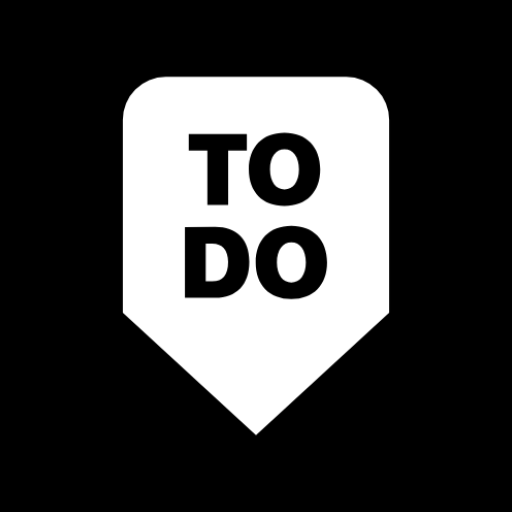
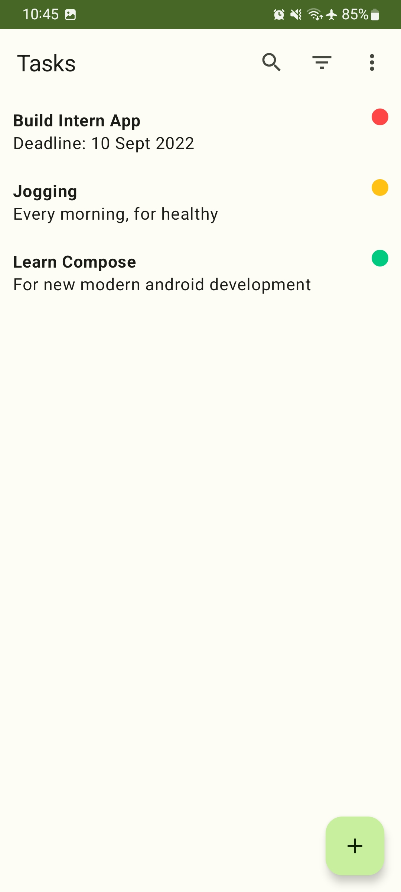
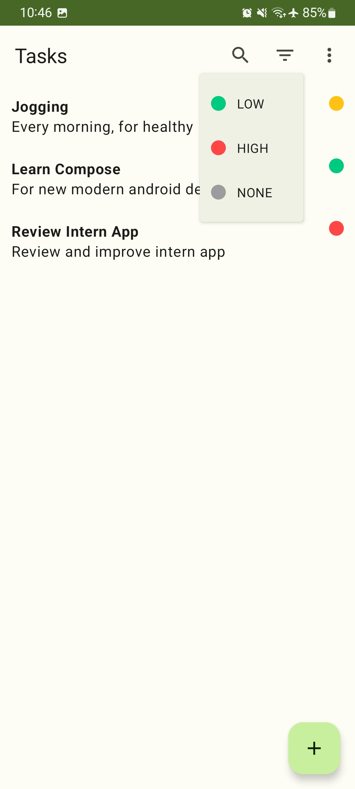
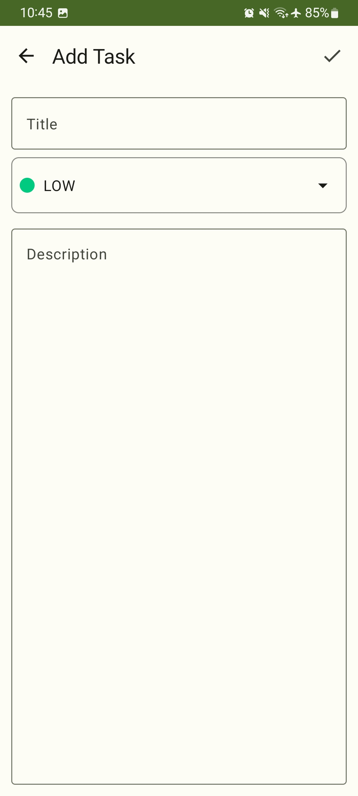

# **To Do**

### Let's Start Our Labs!

This application is purpose to help user find food or drink recipes.  
 

## Download App

## Features
- List Tasks
- Sort Tasks
- Add, Update and Delete Task
- Clean and Simple "Material You"
- Light Mode and Dark Mode 🌗

## 📸 Screenshots
||||
|:----------------------------------------:|:-----------------------------------------:|:-----------------------------------------: |
|  |  |  |

## Built With 🛠
- Android Jetpack
    - Compose
    - Flow
    - ViewModel
    - Navigation
    - Room
    - Data Store
- Kotlin
    - Coroutines
- Dagger-Hilt
